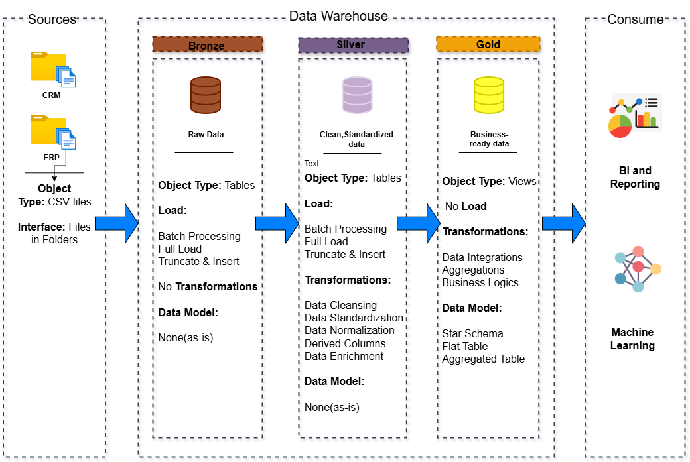

# SQL Data Warehouse & Analytics Project (Beginner Implementation)

Welcome to my **SQL Data Warehouse and Analytics Project**! 🎓  
This project was completed as part of my self-learning journey by following the [Data With Baraa](https://www.youtube.com/@datawithbaraa) YouTube tutorial. It helped me understand and implement a real-world **ETL pipeline and data warehouse** using the **Medallion Architecture** (Bronze, Silver, Gold layers).

---

## 📚 What I Learned

- How to design and build a **modern data warehouse**
- The importance of separating ETL processes using **Bronze, Silver, and Gold layers**
- How to perform **data cleaning, integration, and modeling**
- Basics of **data architecture, flow, and integrity**
- Hands-on experience with **SQL Server**, **Draw.io**
- This is my first complete end-to-end data project, and it showcases my understanding of core data engineering concepts.

---

## 🏗️ Data Architecture (Medallion Approach)

The project follows the **Medallion Architecture**:


1. **Bronze Layer**: Raw data from CSV files (ERP & CRM) is loaded into staging tables in SQL Server.
2. **Silver Layer**: Data is cleaned, standardized, and transformed to remove duplicates and fix inconsistencies.
3. **Gold Layer**: Final business views are created in a star schema format, ready for analysis and reporting.

---

## 💡 Project Overview

This project simulates a data pipeline for a company collecting data from:
- **CRM System**: Customers, Contacts, Opportunities
- **ERP System**: Products, Sales, Suppliers

The goal was to:
- Build a data warehouse using **SQL Server**
- Apply **ETL processes** using SQL scripts
- Create **analytical models** and business views
- Design supporting **diagrams** for documentation

---

## 🔨 Tools & Technologies Used

- **SQL Server Express** – Lightweight database server
- **SQL Server Management Studio (SSMS)** – GUI for SQL scripting
- **CSV Files** – Mock datasets for ERP and CRM systems
- **Draw.io** – For architecture, data model, and flow diagrams

---

## 📦 Repository Structure

```
sql-data-warehouse-project/
│
├── datasets/
│   # ERP & CRM raw CSV files
│
├── docs/
│   ├── design_architecture.png  # Architecture overview
│   ├── data_flow.png           # Data movement diagram
│   ├── data_model.png          # Star schema models
│   ├── data_integrity.png      # ETL process and logic
│   └── data_catalog.md         # Dataset field definitions
│
├── scripts/
│   ├── bronze/
│   │   # Raw data loading scripts
│   ├── silver/
│   │   # Data transformation scripts
│   └── gold/
│       # Analytical view scripts
│
├── tests/
│   # Test scripts and quality checks
│
└── README.md
    # This file
```


## 📈 Analytical Goals (Gold Layer)

The Gold Layer outputs business-friendly views to analyze:

- 🔍 **Customer Behavior**
- 📦 **Product Sales & Supplier Insights**
- 📊 **Sales Trends and Patterns**

These help simulate how businesses use data for strategic decisions.

---

## 🧠 Key Concepts Practiced

- Data Layering (Bronze → Silver → Gold)
- Data Cleaning & Transformation
- Star Schema Modeling
- ETL Scripting using SQL
- Data Architecture Design

---

## 🙋‍♀️ About Me

Hi, I’m **Varshini Chilakala**, a Computer Science student passionate about learning **Data Engineering** and **Backend Development**.  
This project is my first deep dive into SQL-based data warehousing, and I learned a lot by following Baraa's YouTube series.

📬 Let's connect:  
- LinkedIn: [linkedin.com/in/varshini-chilakala](https://www.linkedin.com/in/varshini-chilakala)  
- GitHub: [github.com/varshini-chilakala](https://github.com/Varshini-Chilakala)

---

## 🙏 Credits

Special thanks to **Baraa Khatib Salkini** a.k.a [Data With Baraa](https://www.youtube.com/@datawithbaraa) for the amazing tutorial that guided me through this project step by step.  
Original Project: [YouTube Playlist](https://www.youtube.com/@datawithbaraa)
